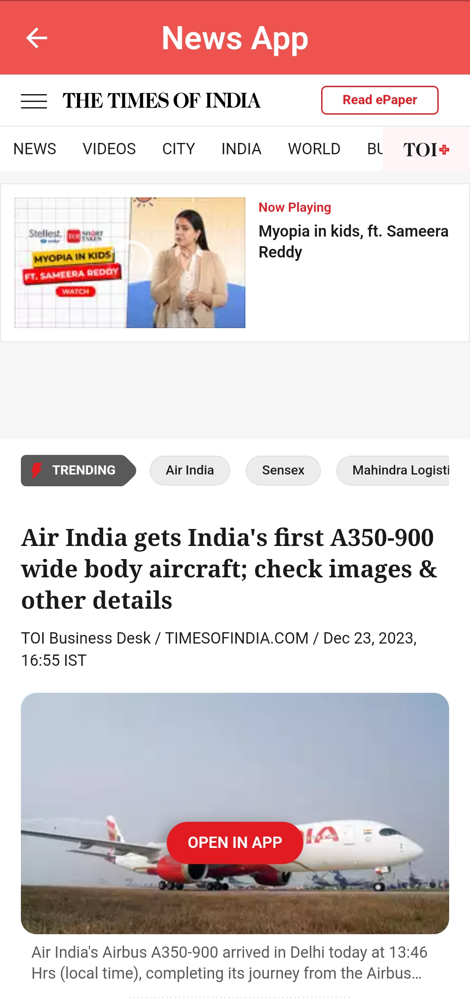

# Project Name

News App

## Description

News App created using Flutter/Dart and News API for fetching realtime data, having features like top headlines of different countries and search using different keywords.

# Features
- Top headlines of different countries
- Search using keywords
- See in Web View

## Screenshots

Home Page(Top headlines of India)

Select other countries to see their headlines

Search Page and suggestions

Search Results

Web View

<!-- Add more screenshots as needed -->

# Preview

*Click above to watch the demo video.*